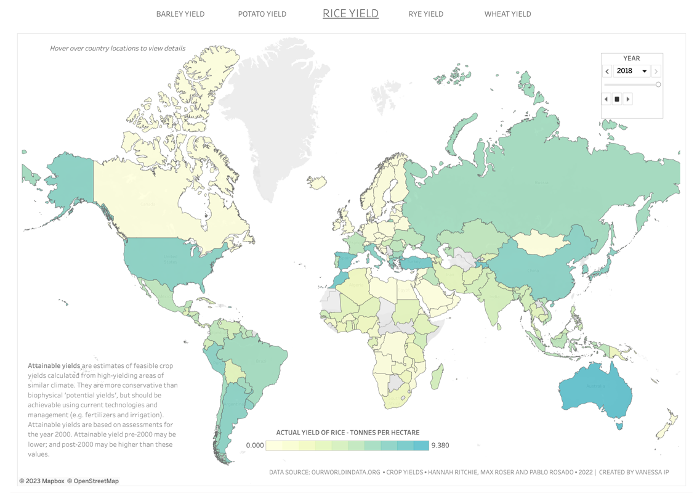

## Global Crop Production

### Table of Contents
- [Background](https://github.com/vanessa-ip/global-crop-production#background)
- [Business task](https://github.com/vanessa-ip/global-crop-production#business-task)
- [Data source](https://github.com/vanessa-ip/global-crop-production#data-source)
- [Entity relationships](https://github.com/vanessa-ip/global-crop-production#entity-relationships)
- [Case study questions](https://github.com/vanessa-ip/global-crop-production#case-study-questions)
- [Solutions on Github](https://github.com/vanessa-ip/global-crop-production/blob/main/global-crop-production-analysis)

### Background

Improvements in crop yields are crucial for feeding a growing population, reducing global poverty rates, and minimizing the environmental impact of food production. With the world's population projected to exceed 9 billion by 2050 (United Nations - Department of Economic and Social Affairs, 2017, The World Population Prospects: The 2017 Revision), it is essential to optimize crop yield.

### Business Task
The exploratory data analysis of global crop yield aims to identify current and past yield trends and patterns across all countries, which can provide valuable insights to policymakers, agricultural practitioners, and food companies. 

This analysis will help these stakeholders understand the availability of different crop types and learn from countries that are efficient at production, informing decisions and planning around resource utilization, sustainability practices, international trade, operations of the food supply chain, and technological innovation in reducing land use while intensifying yield.

### Data Source
- [Crop Yields (2022) - published online at OurWorldInData.org ](https://ourworldindata.org/crop-yields)
- [Land Use (2019) - published online at OurWorldInData.org](https://ourworldindata.org/land-use)

### Entity Relationships 

### Case Study Questions
1. In 2018, for each crop type, which country produced the highest actual yield and which country 
produced the lowest actual yield? 
2. In 2018, for each crop type, which country had the highest yield ratio, and which country 
had the lowest yield ratio?
3. For each country, what is the average yield ratio of each crop in the decade of 2008 - 2018?
4. For each country, what is the average yield ratio across all the crops in the decade of 2008 - 2018?
5. What is the total global actual yield of each crop between 1961 - 2018? Which crop produced 
the most yield overtime?
6. Compare the decade-over-decade distribution of crop yield efficiency for these crops: sugarcane and millet
7. Which crop was produced by the most number of countries 
8. Compare the decade-over-decade distribution of crop yield efficiency for these crops: potato and oil palm
9. Exploring potato production further, rank the countries with highest to lowest attainable yield. Compare
the attainable yield with the average actual yield of those countries. 
10. With the land area information of Brazil, Canada, China, India, and United States, what is the change 
of cropland space and the growth rate of the total actual crop yield from 1961 - 2016?

