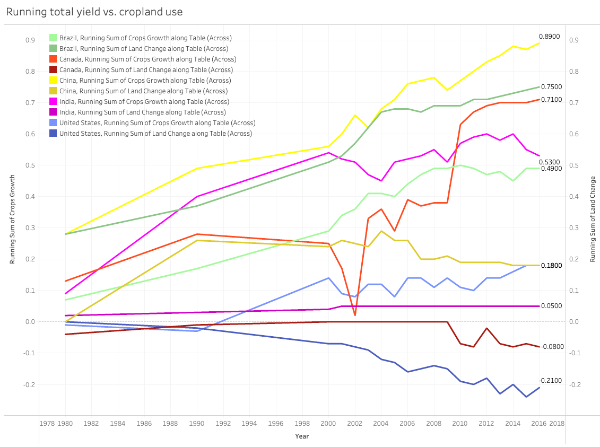

# Global Crop Production

### Table of Contents
- [Preparing the data](/global-crop-production-analysis.md#preparing-the-data)
- [Definitions](/global-crop-production-analysis.md#definitions)
- [Data analysis](/global-crop-production-analysis.md#data-analysis)
  - [Segment by crop](/global-crop-production-analysis.md#segment-by-crop)
  - [Segment by country](/global-crop-production-analysis.md#segment-by-country)
- [Recommendations](/global-crop-production-analysis.md#recommendations)

## Definitions

- **Actual yield**: crop yields measured in tonnes per hectare.


- **Attainable yield**: estimates of feasible crop yields calculated from high-yielding areas of similar climate. They are more conservative than biophysical
‘potential yields’, but should be achievable using current technologies and management (e.g. fertilizers and irrigation). Attainable yields are based on
assessments for the year 2000. Attainable yield pre-2000 may be lower; and post-2000 may be higher than these values.


- **Attainable yield gap**: measures the difference between actual and attainable yields. Attainable yields are estimates of feasible crop yields calculated from high-yielding
areas of similar climate. They are more conservative than biophysical ‘potential yields’, but should be achievable using current technologies and management
(e.g. fertilizers and irrigation).


## Preparing the Data

- Unpivot the original table to transform all the separate 'crop'_attainable and 'crop'_yield_gap columns into two columns: yield (FLOAT64) for the numeric values, and crop (STRING) for the different types of crops

**[View the original table: crops.csv](csv/crops.csv)**

|    | Entity  | Year | barley_attainable |    cassava_attainable |    cotton_attainable |    groundnut_attainable | maize_attainable |  ... |
|---:|:--------|-----:|------------------:|----------------------:|---------------------:|------------------------:|-----------------:|-----:|
|  0 | Belarus | 1992 |              5.44 |                     0 |                    0 |                       0 |             9.25 |  ... |
|  1 | Belarus | 1993 |              5.44 |                     0 |                    0 |                       0 |             9.25 |  ... |
|  2 | Belarus | 1994 |              5.44 |                     0 |                    0 |                       0 |             9.25 |  ... |
|  3 | Belarus | 1995 |              5.44 |                     0 |                    0 |                       0 |             9.25 |  ... |
|  4 | Belarus | 1996 |              5.44 |                     0 |                    0 |                       0 |             9.25 |  ... |
|  ... | ...     | ...  |             ...   |                   ... |                  ... |                     ... |              ... |  ... |


STEPS
```SQL
-- unpivot 'crop'_yield_gap columns into the new crop column using yield values 
SELECT Entity, 
    Year, 
    yield, 
    crop
FROM `crop-yields-world-data.crop_yields.crops`
unpivot(
  yield for crop in (barley_yield_gap, rye_yield_gap, millet_yield_gap, sorghum_yield_gap, maize_yield_gap,
  cassava_yield_gap, soybeans_yield_gap, rapeseed_yield_gap, sugarbeet_yield_gap, potato_yield_gap, oilpalm_yield_gap,
  groundnut_yield_gap, rice_yield_gap, sunflower_yield_gap, cotton_yield_gap, sugarcane_yield_gap, wheat_yield_gap)
) sub

UNION ALL

-- unpivot 'crop'_attainable columns into the new crop column using yield values 
SELECT Entity, 
    Year, 
    yield, 
    crop
FROM `crop-yields-world-data.crop_yields.crops`
unpivot(
  yield for crop in (barley_attainable, rye_attainable, millet_attainable, sorghum_attainable, maize_attainable,
  cassava_attainable, soybean_attainable, rapeseed_attainable, sugarbeet_attainable, potato_attainable, oilpalm_attainable,
  groundnut_attainable, rice_attainable, sunflower_attainable, cotton_attainable, sugarcane_attainable, wheat_attainable)
) sub

UNION ALL 

-- calculate the actual yield (attainable yield - yield gap) for each crop below, and create a row for the actual yield per country per year 
SELECT Entity, Year, (barley_attainable - barley_yield_gap) as yield, "barley_yield" as crop
FROM `crop-yields-world-data.crop_yields.crops`

UNION ALL

SELECT Entity, Year, (rye_attainable - rye_yield_gap) as yield, "rye_yield" as crop
FROM `crop-yields-world-data.crop_yields.crops`

UNION ALL

SELECT Entity, Year, (millet_attainable - millet_yield_gap) as yield, "millet_yield" as crop
FROM `crop-yields-world-data.crop_yields.crops`

UNION ALL

SELECT Entity, Year, (sorghum_attainable - sorghum_yield_gap) as yield, "sorghum_yield" as crop
FROM `crop-yields-world-data.crop_yields.crops`

UNION ALL

SELECT Entity, Year, (maize_attainable - maize_yield_gap) as yield, "maize_yield" as crop
FROM `crop-yields-world-data.crop_yields.crops`

UNION ALL

SELECT Entity, Year, (cassava_attainable - cassava_yield_gap) as yield, "cassava_yield" as crop
FROM `crop-yields-world-data.crop_yields.crops`

UNION ALL

SELECT Entity, Year, (soybean_attainable - soybeans_yield_gap) as yield, "soybean_yield" as crop
FROM `crop-yields-world-data.crop_yields.crops`

UNION ALL

SELECT Entity, Year, (rapeseed_attainable - rapeseed_yield_gap) as yield, "rapeseed_yield" as crop
FROM `crop-yields-world-data.crop_yields.crops`

UNION ALL

SELECT Entity, Year, (sugarbeet_attainable - sugarbeet_yield_gap) as yield, "sugarbeet_yield" as crop
FROM `crop-yields-world-data.crop_yields.crops`

UNION ALL

SELECT Entity, Year, (potato_attainable - potato_yield_gap) as yield, "potato_yield" as crop
FROM `crop-yields-world-data.crop_yields.crops`

UNION ALL

SELECT Entity, Year, (oilpalm_attainable - oilpalm_yield_gap) as yield, "oilpalm_yield" as crop
FROM `crop-yields-world-data.crop_yields.crops`

UNION ALL

SELECT Entity, Year, (groundnut_attainable - groundnut_yield_gap) as yield, "groundnut_yield" as crop
FROM `crop-yields-world-data.crop_yields.crops`

UNION ALL

SELECT Entity, Year, (rice_attainable - rice_yield_gap) as yield, "rice_yield" as crop
FROM `crop-yields-world-data.crop_yields.crops`

UNION ALL

SELECT Entity, Year, (sunflower_attainable - sunflower_yield_gap) as yield, "sunflower_yield" as crop
FROM `crop-yields-world-data.crop_yields.crops`

UNION ALL

SELECT Entity, Year, (cotton_attainable - cotton_yield_gap) as yield, "cotton_yield" as crop
FROM `crop-yields-world-data.crop_yields.crops`

UNION ALL

SELECT Entity, Year, (sugarcane_attainable - sugarcane_yield_gap) as yield, "sugarcane_yield" as crop
FROM `crop-yields-world-data.crop_yields.crops`

UNION ALL

SELECT Entity, Year, (wheat_attainable - wheat_yield_gap) as yield, "wheat_yield" as crop
FROM `crop-yields-world-data.crop_yields.crops`
```

RESULT

**[View the transformed table: unpivot_crops.csv](csv/unpivot_crops.csv)**

|     | Entity  | Year | yield | crop   |
|----:|:--------|-----:|------:|:-------|
|   0 | Belarus | 1992 |  3.06 | rye_yield |
|   1 | Belarus | 1993 |   2.8 | rye_yield |
|   2 | Belarus | 1994 |  2.25 | rye_yield |
|   3 | Belarus | 1995 |  2.21 | rye_yield |
|   4 | Belarus | 1996 |  2.07 | rye_yield |
| ... | ...     |  ... | ...   | ...    |


## Data Analysis 

### Segment by Crop
<br>

**QUESTION 1** 

**In the most recent year of the dataset (2018), what is the total actual yield per crop type and their percentage share among all types?** 

STEPS
```SQL
-- find the global actual yield of each crop type in 2018
SELECT crop, 
ROUND(SUM(yield),2) as global_yield,
ROUND((SUM(yield)/SUM(SUM(yield)) OVER()),2) as pct_share
FROM `crop-yields-world-data.crop_yields.unpivot_crops`
WHERE crop LIKE "%yield" AND Year = 2018 
GROUP BY crop ORDER BY global_yield DESC
```
RESULT

In 2018:
- Sugarcane is the highest crop yield in the world, followed by potato and sugar beet
- More than half of the crop types (9 of 17) contribute to ~10% of the total global yield

|    | crop            |   global_yield |   pct_share |
|---:|:----------------|---------------:|------------:|
|  0 | sugarcane_yield |        4589.72 |        0.35 |
|  1 | potato_yield    |        2450.04 |        0.19 |
|  2 | sugarbeet_yield |        2442.07 |        0.19 |
|  3 | cassava_yield   |         690.99 |        0.05 |
|  4 | maize_yield     |         527.14 |        0.04 |
|  5 | oilpalm_yield   |         420.94 |        0.03 |
|  6 | rice_yield      |         387.82 |        0.03 |
|  7 | wheat_yield     |         328.48 |        0.03 |
|  8 | barley_yield    |         243.67 |        0.02 |
|  9 | sorghum_yield   |         172.18 |        0.01 |
| 10 | soybean_yield   |         149    |        0.01 |
| 11 | rye_yield       |         146.27 |        0.01 |
| 12 | groundnut_yield |         136.39 |        0.01 |
| 13 | rapeseed_yield  |         122.47 |        0.01 |
| 14 | cotton_yield    |         114.08 |        0.01 |
| 15 | sunflower_yield |          97.14 |        0.01 |
| 16 | millet_yield    |          83.76 |        0.01 |

<br>

**QUESTION 2**

**Expanding on question 1, for each crop type, what is the decade-to-decade growth rate of actual yield, and the total growth rate of actual yield from the decade of 1969-1978 to 2009-2018?**  

STEPS 
```SQL
WITH cte_decades as ( -- find the global actual yield of each crop type in each decade and combine results using UNION ALL 
  SELECT crop, -- find global actual yield of each crop between 2009 - 2018
  ROUND(SUM(yield),2) as global_yield,
  ROUND((SUM(yield)/SUM(SUM(yield)) OVER()),2) as pct_share_of_crops, 
  "2009 - 2018" AS decade
  FROM `crop-yields-world-data.crop_yields.unpivot_crops`
  WHERE crop LIKE "%yield" AND Year BETWEEN 2009 AND 2018 
  GROUP BY crop

  UNION ALL

  SELECT crop,  -- find global actual yield of each crop between 1999 - 2008
  ROUND(SUM(yield),2) as global_yield,
  ROUND((SUM(yield)/SUM(SUM(yield)) OVER()),2) as pct_share_of_crops, 
  "1999 - 2008" AS decade
  FROM `crop-yields-world-data.crop_yields.unpivot_crops`
  WHERE crop LIKE "%yield" AND Year BETWEEN 1999 AND 2008 
  GROUP BY crop 

  UNION ALL

  SELECT crop,  -- find global actual yield of each crop between 1989 - 1998
  ROUND(SUM(yield),2) as global_yield,
  ROUND((SUM(yield)/SUM(SUM(yield)) OVER()),2) as pct_share_of_crops, 
  "1989 - 1998" AS decade
  FROM `crop-yields-world-data.crop_yields.unpivot_crops`
  WHERE crop LIKE "%yield" AND Year BETWEEN 1989 AND 1998 
  GROUP BY crop 

  UNION ALL

  SELECT crop,  -- find global actual yield of each crop between 1979 - 1988
  ROUND(SUM(yield),2) as global_yield,
  ROUND((SUM(yield)/SUM(SUM(yield)) OVER()),2) as pct_share_of_crops, 
  "1979 - 1988" AS decade
  FROM `crop-yields-world-data.crop_yields.unpivot_crops`
  WHERE crop LIKE "%yield" AND Year BETWEEN 1979 AND 1988 
  GROUP BY crop 

  UNION ALL

  SELECT crop,  -- find global actual yield of each crop between 1969 - 1978
  ROUND(SUM(yield),2) as global_yield,
  ROUND((SUM(yield)/SUM(SUM(yield)) OVER()),2) as pct_share_of_crops, 
  "1969 - 1978" AS decade
  FROM `crop-yields-world-data.crop_yields.unpivot_crops`
  WHERE crop LIKE "%yield" AND Year BETWEEN 1969 AND 1978 
  GROUP BY crop 
  ORDER BY crop
)
, lag_yields as ( -- create a new column to LAG the global actual yield per crop 
SELECT *, 
LAG(global_yield) OVER(PARTITION BY crop order by decade) as lag_global_yield, 
FROM cte_decades 
)
, yield_growth_overtime as ( -- calculate the decade-to-decade growth rate of actual yield per crop 
SELECT crop, 
global_yield, 
ROUND(((global_yield/lag_global_yield)-1),2) as yield_growth,
pct_share_of_crops, 
decade FROM lag_yields
)
-- calculate the decade-to-decade running total of yield growth to find the total yield growth per crop
-- , total_growth as (
  SELECT crop, global_yield, yield_growth, 
ROUND((SUM(yield_growth) OVER(PARTITION BY crop ORDER BY decade ROWS BETWEEN UNBOUNDED PRECEDING AND CURRENT ROW)),2) as running_total_yield_growth,
pct_share_of_crops, decade FROM yield_growth_overtime ORDER BY crop
-- )
-- SELECT * FROM total_growth WHERE decade = "2009 - 2018" ORDER BY running_total_yield_growth DESC
```                                                                   
RESULT                                                                  

In the span of 5 decades:
- The yield (amount) of rapeseed, soybean, maize and rye have more than doubled (increased 100%)
- The yield (amount) of oil palm, cassava and sugarcane have increased than 50%
- 14 of the 17 types of crops (82%) increased yield by 50% or more 

**[View full table results](csv/crop_q2.csv)**

|    | crop                | global_yield | yield_growth | running_total_yield_growth | pct_share_of_crops | decade          |
|---:|:--------------------|-------------:|-------------:|---------------------------:|-------------------:|:----------------|
|  0 | barley_yield        |       1135.8 |          nan |                        nan |               0.01 | 1969 - 1978     |
|  1 | barley_yield        |      1373.11 |         0.21 |                       0.21 |               0.02 | 1979 - 1988     |
|  2 | barley_yield        |      1829.07 |         0.33 |                       0.54 |               0.02 | 1989 - 1998     |
|  3 | barley_yield        |      2168.74 |         0.19 |                       0.73 |               0.02 | 1999 - 2008     |
|  4 | **barley_yield**    |  **2418.67** |     **0.12** |                   **0.85** |           **0.02** | **2009 - 2018** |
|  5 | cassava_yield       |      4698.11 |          nan |                        nan |               0.06 | 1969 - 1978     |
|  6 | cassava_yield       |      4988.96 |         0.06 |                       0.06 |               0.06 | 1979 - 1988     |
|  7 | cassava_yield       |      5372.35 |         0.08 |                       0.14 |               0.05 | 1989 - 1998     |
|  8 | cassava_yield       |      6257.07 |         0.16 |                        0.3 |               0.05 | 1999 - 2008     |
|  9 | **cassava_yield**   |  **6741.28** |     **0.08** |                   **0.38** |           **0.05** | **2009 - 2018** |
| 10 | cotton_yield        |       731.15 |          nan |                        nan |               0.01 | 1969 - 1978     |
| 11 | cotton_yield        |       844.79 |         0.16 |                       0.16 |               0.01 | 1979 - 1988     |
| 12 | cotton_yield        |      1001.16 |         0.19 |                       0.35 |               0.01 | 1989 - 1998     |
| 13 | cotton_yield        |       1104.2 |          0.1 |                       0.45 |               0.01 | 1999 - 2008     |
| 14 | **cotton_yield**    |  **1160.55** |     **0.05** |                    **0.5** |           **0.01** | **2009 - 2018** |
| 15 | groundnut_yield     |       836.23 |          nan |                        nan |               0.01 | 1969 - 1978     |
| 16 | groundnut_yield     |       896.28 |         0.07 |                       0.07 |               0.01 | 1979 - 1988     |
| 17 | groundnut_yield     |      1031.48 |         0.15 |                       0.22 |               0.01 | 1989 - 1998     |
| 18 | groundnut_yield     |      1185.53 |         0.15 |                       0.37 |               0.01 | 1999 - 2008     |
| 19 | **groundnut_yield** |  **1334.04** |     **0.13** |                    **0.5** |           **0.01** | **2009 - 2018** |
| 20 | maize_yield         |       1908.2 |          nan |                        nan |               0.02 | 1969 - 1978     |
| 21 | maize_yield         |       2344.4 |         0.23 |                       0.23 |               0.03 | 1979 - 1988     |
| 22 | maize_yield         |      3277.36 |          0.4 |                       0.63 |               0.03 | 1989 - 1998     |
| 23 | maize_yield         |      4272.31 |          0.3 |                       0.93 |               0.04 | 1999 - 2008     |
| 24 | **maize_yield**     |  **4970.55** |     **0.16** |                   **1.09** |           **0.04** | **2009 - 2018** |
| 25 | ...                 |          ... |          ... |                        ... |                ... | ...             |


<br>
                                                               
**QUESTION 3**

**For each type of crop, count the number of countries that produce the crop. Compare the change in the number of countries producing a crop from the decade of 1969-1978 to 2009-2018.** 

STEPS
```SQL
WITH num_countries_2018 as ( -- count the number of countries that produce for each crop from 2009-2018
SELECT crop, count(DISTINCT Entity) as num_countries_2009_2018
FROM `crop-yields-world-data.crop_yields.unpivot_crops`
WHERE crop LIKE "%attainable" AND yield != 0 AND Year BETWEEN 2009 AND 2018
GROUP BY crop ORDER BY num_countries_2009_2018 DESC
)
, num_countries_1978 as ( -- count the number of countries that produce for each crop from 1969-1978
SELECT crop, count(DISTINCT Entity) as num_countries_1969_1978
FROM `crop-yields-world-data.crop_yields.unpivot_crops`
WHERE crop LIKE "%attainable" AND yield != 0 AND Year BETWEEN 1969 AND 1978
GROUP BY crop ORDER BY num_countries_1969_1978 DESC
)
-- find the percentage change in number of countries producing for each crop from 1969-1978 to 2009-2018
SELECT *, ROUND(((num_countries_2009_2018/num_countries_1969_1978)-1),2) as change_1969_to_2018
 FROM num_countries_2018 INNER JOIN num_countries_1978 USING(crop)
 ORDER BY num_countries_2009_2018 DESC
```

RESULT

The number of countries producing the crop(s):

- Potato, maize and wheat were the highest in 2009-2018
- Rye had the highest increase from the 1969-1978 to 2009-2018
- Oil palm did not change over time 

|    | crop                 |   num_countries_2009_2018 |   num_countries_1969_1978 |   change_1969_to_2018 |
|---:|:---------------------|--------------------------:|--------------------------:|----------------------:|
|  0 | potato_attainable    |                       126 |                       103 |                  0.22 |
|  1 | maize_attainable     |                       122 |                       101 |                  0.21 |
|  2 | wheat_attainable     |                       107 |                        84 |                  0.27 |
|  3 | rice_attainable      |                        98 |                        87 |                  0.13 |
|  4 | soybean_attainable   |                        97 |                        77 |                  0.26 |
|  5 | sorghum_attainable   |                        93 |                        79 |                  0.18 |
|  6 | groundnut_attainable |                        90 |                        82 |                  0.1  |
|  7 | barley_attainable    |                        84 |                        62 |                  0.35 |
|  8 | cotton_attainable    |                        81 |                        72 |                  0.13 |
|  9 | sugarcane_attainable |                        79 |                        77 |                  0.03 |
| 10 | millet_attainable    |                        78 |                        64 |                  0.22 |
| 11 | rapeseed_attainable  |                        71 |                        52 |                  0.37 |
| 12 | sunflower_attainable |                        71 |                        53 |                  0.34 |
| 13 | cassava_attainable   |                        65 |                        63 |                  0.03 |
| 14 | sugarbeet_attainable |                        64 |                        44 |                  0.45 |
| 15 | rye_attainable       |                        57 |                        37 |                  0.54 |
| 16 | oilpalm_attainable   |                        43 |                        43 |                  0    |

<br> 

**QUESTION 4**

**For each crop, what is the average yield efficiency in the decade of 2009-2018?** 

The yield efficiency is the ratio of actual yield / attainable yield. Refer to [definitions](/global-crop-production-analysis.md#definitions).

STEPS

```SQL
WITH act_yields as ( -- filter for the actual yield values in 2009-2018
  SELECT Entity,
  Year,
  SUBSTR(crop, 0, (STRPOS(crop, '_')-1)) as crop, -- edit the crop name for joining later
  yield as act_yield,
  FROM `crop-yields-world-data.crop_yields.unpivot_crops`
  WHERE (Year BETWEEN 2009 AND 2018) AND (crop LIKE "%yield")
)
, att_yields as ( -- filter for attainable yield values
  SELECT distinct Entity, 
  SUBSTR(crop, 0, (STRPOS(crop, '_')-1)) as crop, -- edit the crop name for joining later
  yield as att_yield
  FROM `crop-yields-world-data.crop_yields.unpivot_crops`
  WHERE crop LIKE "%attainable"
  ORDER BY Entity
) 
, eff_ratio as ( -- join the actual and attainable yield cte's and calculate the efficiency ratio per country per crop per year
  SELECT Entity, crop, Year, NULLIF(act_yield, 0)/NULLIF(att_yield, 0) as ratio,
  FROM act_yields
  INNER JOIN att_yields 
  USING(Entity, crop)
)
-- find the average ratio per crop
SELECT crop, ROUND((avg(avg(ratio)) OVER(PARTITION BY crop)),2) as avg_ratio_per_crop 
FROM eff_ratio GROUP BY crop ORDER BY avg_ratio_per_crop DESC
```

RESULT

In the decade of 2009-2018, the average yield efficiency was: 

- Highest for rapeseed 
- Lowest for sorghum
- Greater than 50% for all crop types 

|    | crop      |   avg_ratio_per_crop |
|---:|:----------|---------------------:|
|  0 | rapeseed  |                 0.78 |
|  1 | sunflower |                 0.75 |
|  2 | sugarbeet |                 0.71 |
|  3 | millet    |                 0.68 |
|  4 | potato    |                 0.67 |
|  5 | barley    |                 0.65 |
|  6 | sugarcane |                 0.64 |
|  7 | oilpalm   |                 0.63 |
|  8 | maize     |                 0.62 |
|  9 | soybean   |                 0.61 |
| 10 | rice      |                 0.61 |
| 11 | cotton    |                 0.61 |
| 12 | cassava   |                 0.61 |
| 13 | wheat     |                 0.59 |
| 14 | rye       |                 0.59 |
| 15 | groundnut |                 0.58 |
| 16 | sorghum   |                 0.57 |


**QUESTION 5**

**Expanding on question 4, for each crop, what is the change of the yield efficiency from the decade of 1969-1978 to 2009-2018?** 

STEPS

```SQL
WITH act_yields_2018 as ( -- filter for the actual yield values in 2009-2018
  SELECT Entity,
Year,
SUBSTR(crop, 0, (STRPOS(crop, '_')-1)) as crop, -- edit the crop name for joining later
yield as act_yield,
FROM `crop-yields-world-data.crop_yields.unpivot_crops`
WHERE (Year BETWEEN 2009 AND 2018) AND (crop LIKE "%yield")
)
, att_yields as ( -- filter for attainable yield values 
  SELECT distinct Entity, 
SUBSTR(crop, 0, (STRPOS(crop, '_')-1)) as crop, -- edit the crop name for joining later
yield as att_yield
FROM `crop-yields-world-data.crop_yields.unpivot_crops`
WHERE crop LIKE "%attainable"
ORDER BY Entity
) 
, eff_ratio_2018 as ( -- join the actual and attainable yield cte's and calculate the efficiency ratio for 2009-2018
  SELECT Entity, crop, Year, NULLIF(act_yield, 0)/NULLIF(att_yield, 0) as ratio,
FROM act_yields_2018
INNER JOIN att_yields 
USING(Entity, crop)
)
, avg_eff_ratio_2018 as ( -- find the average ratio per crop in 2009-2018
  SELECT crop, ROUND((avg(avg(ratio)) OVER(PARTITION BY crop)),2) as avg_ratio_per_crop_2018
FROM eff_ratio_2018 GROUP BY crop ORDER BY avg_ratio_per_crop_2018 DESC
)
, act_yields_1978 as ( -- filter for the actual yield values in 1969-1978
  SELECT Entity,
Year,
SUBSTR(crop, 0, (STRPOS(crop, '_')-1)) as crop, -- edit crop name for joining later
yield as act_yield,
FROM `crop-yields-world-data.crop_yields.unpivot_crops`
WHERE (Year BETWEEN 1969 AND 1978) AND (crop LIKE "%yield")
) 
, eff_ratio_1978 as ( -- join the actual and attainble yield cte's and calculate the efficiency ratio for 1969-1978
  SELECT Entity, crop, Year, NULLIF(act_yield, 0)/NULLIF(att_yield, 0) as ratio,
FROM act_yields_1978
INNER JOIN att_yields
USING(Entity, crop)
)
, avg_eff_ratio_1978 as ( -- find the average ratio per crop in 1969-1978
  SELECT crop, ROUND((avg(avg(ratio)) OVER(PARTITION BY crop)),2) as avg_ratio_per_crop_1978 
FROM eff_ratio_1978 GROUP BY crop ORDER BY avg_ratio_per_crop_1978 DESC
)
-- join the avg_eff_ratio of 2009-2018 with 1969-1978 cte's, and calculate the change in ratio
SELECT crop, 
avg_ratio_per_crop_2018 as avg_ratio_per_crop_2009_2018,
avg_ratio_per_crop_1978 as avg_ratio_per_crop_1969_1978,
ROUND(((avg_ratio_per_crop_2018/avg_ratio_per_crop_1978)-1),2) as efficiency_ratio_growth
FROM avg_eff_ratio_2018 
INNER JOIN avg_eff_ratio_1978 
USING(crop) 
ORDER BY avg_ratio_per_crop_2018 DESC
```

RESULTS

The change in yield efficiency in the span of 5 decades:

- Increased the most for maize by 100% 
- Increased the least for sugarcane by 10%
- Increased for one-third of the crop types (6 of 17) by over 50% 

|    | crop      |   avg_ratio_per_crop_2009_2018 |   avg_ratio_per_crop_1969_1978 |   efficiency_ratio_growth |
|---:|:----------|-------------------------------:|-------------------------------:|--------------------------:|
|  0 | rapeseed  |                           0.78 |                           0.55 |                      0.42 |
|  1 | sunflower |                           0.75 |                           0.51 |                      0.47 |
|  2 | sugarbeet |                           0.71 |                           0.51 |                      0.39 |
|  3 | millet    |                           0.68 |                           0.54 |                      0.26 |
|  4 | potato    |                           0.67 |                           0.4  |                      0.68 |
|  5 | barley    |                           0.65 |                           0.42 |                      0.55 |
|  6 | sugarcane |                           0.64 |                           0.58 |                      0.1  |
|  7 | oilpalm   |                           0.63 |                           0.51 |                      0.24 |
|  8 | maize     |                           0.62 |                           0.31 |                      1    |
|  9 | cassava   |                           0.61 |                           0.45 |                      0.36 |
| 10 | cotton    |                           0.61 |                           0.45 |                      0.36 |
| 11 | soybean   |                           0.61 |                           0.44 |                      0.39 |
| 12 | rice      |                           0.61 |                           0.38 |                      0.61 |
| 13 | rye       |                           0.59 |                           0.37 |                      0.59 |
| 14 | wheat     |                           0.59 |                           0.36 |                      0.64 |
| 15 | groundnut |                           0.58 |                           0.45 |                      0.29 |
| 16 | sorghum   |                           0.57 |                           0.42 |                      0.36 |

<br>


### Segment by Country
<br>

**QUESTION 1**

**For each country, what is the number of different types of crop it produces?** 

STEPS
```SQL
-- find the number of different types of crop each country produces 
SELECT Entity, COUNT(DISTINCT crop) as num_crop_types
FROM `crop-yields-world-data.crop_yields.unpivot_crops`
WHERE crop LIKE "%yield" AND yield != 0 AND Entity != "World"
GROUP BY Entity 
ORDER BY num_crop_types DESC
```
RESULTS

Out of 153 countries:

- China produces the most crop types (17 of 17)
- United Arab Emirates produces the least crop types (1 of 17) 

[View full table results](csv/country_q1.csv)

|     | Entity        | num_crop_types |
|----:|:--------------|---------------:|
|   0 | China         |             17 |
|   1 | Mexico        |             16 |
|   2 | Argentina     |             15 |
|   3 | United States |             15 |
|   4 | Morocco       |             15 |
|   5 | Spain         |             15 |
|   6 | Kazakhstan    |             14 |
|   7 | Greece        |             14 |
|   8 | Turkey        |             14 |
|   9 | Ecuador       |             14 |
|  10 | Kyrgyzstan    |             14 |
|  11 | Bulgaria      |             14 |
|  12 | Australia     |             14 |
|  13 | Pakistan      |             14 |
|  14 | Tanzania      |             14 |
|  15 | Colombia      |             14 |
|  16 | India         |             14 |
|  17 | Tajikistan    |             13 |
|  18 | Peru          |             13 |
|  19 | South Africa  |             13 |
|  20 | Bolivia       |             13 |
|  21 | ...           |            ... |

<br>

**QUESTION 2** 

**Expanding on question 1, what is the percentage of countries that produce a certain percentage of crop types?** 

Bucket the percentage of countries into bins of 1 - 24%, 25 - 49%, 50 - 74%, and over 75% of the 17 crop types.

STEPS
```SQL
WITH cte as ( -- count the different number of crops each country produces
  SELECT Entity, COUNT(DISTINCT crop) as num_crop_types
FROM `crop-yields-world-data.crop_yields.unpivot_crops`
WHERE crop LIKE "%yield" AND yield != 0 AND Entity != "World"
GROUP BY Entity 
ORDER BY num_crop_types DESC
)
, distribution_countries as ( 
-- count the number of countries that produce a certain number of crop types, and calculate the percentage of countries 
-- use case statement to bucket the percentage of countries that produce a certain percentage range of crop types 
  SELECT
ROUND((COUNT(CASE WHEN num_crop_types >= 0.75*17 THEN Entity END)/COUNT(*)),2) as bin_over_75pct_crop_types,
ROUND((COUNT(CASE WHEN num_crop_types BETWEEN 0.5*17 AND 0.749*17 THEN Entity END)/COUNT(*)),2) as
bin_50pct_74pct_crop_types,
ROUND((COUNT(CASE WHEN num_crop_types BETWEEN 0.25*17 AND 0.499*17 THEN Entity END)/COUNT(*)),2) as 
bin_25pct_49pct_crop_types,
ROUND((COUNT(CASE WHEN num_crop_types BETWEEN 1 AND 0.249*17 THEN Entity END)/COUNT(*)),2) as 
bin_1pct_24pct_crop_types
FROM cte
)
SELECT *
FROM distribution_countries 
unpivot(
  pct_countries for pct IN (bin_over_75pct_crop_types, bin_50pct_74pct_crop_types,
  bin_25pct_49pct_crop_types, bin_1pct_24pct_crop_types)
)
```

RESULTS

Out of 153 countries:

- Almost 50% of countries produced 50 - 74 % of different crop types 
- Almost 70% of countries produced more than 50% of different crop types 
- Only 4% of countries produced less than 25% of different crop types 

|    |   pct_countries | pct                        |
|---:|----------------:|:---------------------------|
|  0 |            0.21 | bin_over_75pct_crop_types  |
|  1 |            0.48 | bin_50pct_74pct_crop_types |
|  2 |            0.27 | bin_25pct_49pct_crop_types |
|  3 |            0.04 | bin_1pct_24pct_crop_types  |
                        
<br>

**QUESTION 3** 

**In 2018, for each country, what is the yield per crop, the total yield of all crops, and the percentage share of total yield amongst all countries?**

The rows with 0 yield for a crop are excluded.

STEPS

```SQL
WITH cte as ( -- find the yield per country per crop, the total yield per country, and the total global yield
  SELECT Entity, 
crop, 
ROUND(SUM(yield),2) as total_yield_per_crop,
ROUND((SUM(SUM(yield)) OVER(PARTITION BY Entity)),2) as total_yield_per_country,
ROUND((SUM(SUM(yield)) OVER()),2) as global_yield 
FROM `crop-yields-world-data.crop_yields.unpivot_crops`
WHERE crop LIKE "%yield" AND Year = 2018 AND Entity != "World" AND yield !=0
GROUP BY Entity, crop ORDER BY total_yield_per_country DESC, Entity, crop
)
SELECT *, ROUND(cte.total_yield_per_country/global_yield,4) as pct_yield_share -- find the yield percentage share for each country 
FROM cte ORDER BY cte.total_yield_per_country DESC
```
RESULTS

In 2018:

- The top 5 countries that yielded the most amount of crops overall were United States, China, Spain, Iran, and Morocco
- The bottom 5 countries that yielded the least amount of crops overall were Eritrea, Trinidad and Tobago, Mongolia, Togo, and Gambia
- Even though United States produced the most yield, it only constituted to 1.8% of the share of all countries

**[View full table results](csv/country_q3.csv)** 

|      | Entity        | crop            | total_yield_per_crop | total_yield_per_country | global_yield | pct_yield_share |
|-----:|:--------------|:----------------|---------------------:|------------------------:|-------------:|----------------:|
|    0 | United States | wheat_yield     |                  3.2 |                  235.18 |      12893.4 |          0.0182 |
|    1 | United States | sunflower_yield |                 1.78 |                  235.18 |      12893.4 |          0.0182 |
|    2 | United States | soybean_yield   |                 3.02 |                  235.18 |      12893.4 |          0.0182 |
|    3 | United States | sugarcane_yield |                86.07 |                  235.18 |      12893.4 |          0.0182 |
|    4 | United States | potato_yield    |                44.22 |                  235.18 |      12893.4 |          0.0182 |
|    5 | United States | sorghum_yield   |                 4.53 |                  235.18 |      12893.4 |          0.0182 |
|    6 | United States | rice_yield      |                 7.43 |                  235.18 |      12893.4 |          0.0182 |
|    7 | United States | groundnut_yield |                 3.72 |                  235.18 |      12893.4 |          0.0182 |
|    8 | United States | cotton_yield    |                 2.68 |                  235.18 |      12893.4 |          0.0182 |
|    9 | United States | sugarbeet_yield |                59.04 |                  235.18 |      12893.4 |          0.0182 |
|   10 | United States | rye_yield       |                 1.94 |                  235.18 |      12893.4 |          0.0182 |
|   11 | United States | millet_yield    |                 1.98 |                  235.18 |      12893.4 |          0.0182 |
|   12 | United States | barley_yield    |                  3.8 |                  235.18 |      12893.4 |          0.0182 |
|   13 | United States | rapeseed_yield  |                 1.97 |                  235.18 |      12893.4 |          0.0182 |
|   14 | United States | maize_yield     |                  9.8 |                  235.18 |      12893.4 |          0.0182 |
|   15 | China         | sugarcane_yield |                76.83 |                   227.2 |      12893.4 |          0.0176 |
|   16 | China         | sunflower_yield |                 2.08 |                   227.2 |      12893.4 |          0.0176 |
|   17 | China         | barley_yield    |                 3.86 |                   227.2 |      12893.4 |          0.0176 |
|   18 | China         | groundnut_yield |                 3.75 |                   227.2 |      12893.4 |          0.0176 |
|   19 | China         | rye_yield       |                 3.78 |                   227.2 |      12893.4 |          0.0176 |
|   20 | China         | cotton_yield    |                 4.11 |                   227.2 |      12893.4 |          0.0176 |
|   21 | China         | rapeseed_yield  |                 2.03 |                   227.2 |      12893.4 |          0.0176 |
|   22 | China         | oilpalm_yield   |                12.93 |                   227.2 |      12893.4 |          0.0176 |
|   23 | China         | sorghum_yield   |                 4.47 |                   227.2 |      12893.4 |          0.0176 |
|   24 | China         | maize_yield     |                  6.1 |                   227.2 |      12893.4 |          0.0176 |
|   25 | China         | cassava_yield   |                16.56 |                   227.2 |      12893.4 |          0.0176 |
|   26 | China         | soybean_yield   |                 1.78 |                   227.2 |      12893.4 |          0.0176 |
|   27 | China         | rice_yield      |                 7.03 |                   227.2 |      12893.4 |          0.0176 |
|   28 | China         | wheat_yield     |                 5.26 |                   227.2 |      12893.4 |          0.0176 |
|   29 | China         | millet_yield    |                 1.99 |                   227.2 |      12893.4 |          0.0176 |
|   30 | China         | sugarbeet_yield |                55.88 |                   227.2 |      12893.4 |          0.0176 |
|   31 | China         | potato_yield    |                18.76 |                   227.2 |      12893.4 |          0.0176 |
|   32 | Spain         | barley_yield    |                 3.43 |                   210.3 |      12893.4 |          0.0163 |
|   33 | ...           | ...             |                  ... |                     ... |          ... |             ... |


**QUESTION 4** 

**In 2009-2018, what is the average yield efficiency per country per crop?** 

STEPS
```SQL
WITH act_yields as (
  SELECT Entity, 
  Year, 
  SUBSTR(crop, 0, (STRPOS(crop, '_')-1)) as crop, yield as actual_yield
  FROM `crop-yields-world-data.crop_yields.unpivot_crops`
  WHERE (Year BETWEEN 2008 AND 2018) AND (crop LIKE "%yield")
  ORDER BY Entity, crop, Year
  )
, att_yields as (
  SELECT distinct Entity, 
  SUBSTR(crop, 0, (STRPOS(crop, '_')-1)) as crop, yield as attainable_yield
  FROM `crop-yields-world-data.crop_yields.unpivot_crops`
  WHERE crop LIKE "%attainable"
  ORDER BY Entity
)
, yearly_ratios as (
  SELECT Entity, 
  Year, 
  crop, 
  actual_yield, 
  attainable_yield,
  ROUND(( NULLIF(actual_yield,0) / NULLIF(attainable_yield,0) ),2) as ratio
  FROM act_yields 
  LEFT JOIN att_yields 
  Using(Entity, crop) ORDER BY Entity
)
SELECT Entity, crop, 
ROUND((avg(avg(ratio)) OVER(PARTITION BY crop, Entity)),2) as avg_ratio,
FROM yearly_ratios 
GROUP BY Entity, crop ORDER BY Entity, avg_ratio DESC
```

RESULTS

**[View full table results](csv/country_q4.csv)** to review each country and their average yield efficiency performance for each crop that it produces. The results to question 5 and 6 will provide a higher level summary of each country's average yield efficiency. 

<br> 


**QUESTION 5** 

**To summarize question 4, in 2009-2018 what is the average yield efficiency per country?**

STEPS
```SQL
WITH act_yields as (
  SELECT Entity, 
  Year, 
  SUBSTR(crop, 0, (STRPOS(crop, '_')-1)) as crop, yield as actual_yield
  FROM `crop-yields-world-data.crop_yields.unpivot_crops`
  WHERE (Year BETWEEN 2008 AND 2018) AND (crop LIKE "%yield")
  ORDER BY Entity, crop, Year
  )
, att_yields as (
  SELECT distinct Entity, 
  SUBSTR(crop, 0, (STRPOS(crop, '_')-1)) as crop, yield as attainable_yield
  FROM `crop-yields-world-data.crop_yields.unpivot_crops`
  WHERE crop LIKE "%attainable"
  ORDER BY Entity
)
, yearly_ratios as (
  SELECT Entity, 
  Year, 
  crop, 
  actual_yield, 
  attainable_yield,
  ROUND(( NULLIF(actual_yield,0) / NULLIF(attainable_yield,0) ),2) as ratio
  FROM act_yields 
  LEFT JOIN att_yields 
  Using(Entity, crop) ORDER BY Entity
)
SELECT Entity,
ROUND((avg(avg(ratio)) OVER(PARTITION BY Entity)),2) as avg_ratio_per_country,
FROM yearly_ratios 
GROUP BY Entity ORDER BY avg_ratio_per_country DESC
```

RESULTS

The average yield efficiency of: 

- Saudi Arabia is the highest at 1.0 
- Eritrea is the lowest at 0.27 
- 18 of the 153 countries (11.7%) do not produce any crops 

**[View full table results](csv/country_q5.csv)**

**QUESTION 6**

**What is percentage change of yield efficiency per country from 1969-1978 to 2009-2018?** 

STEPS
```SQL
WITH act_yields as (
  SELECT Entity, 
  Year, 
  SUBSTR(crop, 0, (STRPOS(crop, '_')-1)) as crop, yield as actual_yield
  FROM `crop-yields-world-data.crop_yields.unpivot_crops`
  WHERE (Year BETWEEN 2008 AND 2018) AND (crop LIKE "%yield")
  ORDER BY Entity, crop, Year
  )
, att_yields as (
  SELECT distinct Entity, 
  SUBSTR(crop, 0, (STRPOS(crop, '_')-1)) as crop, yield as attainable_yield
  FROM `crop-yields-world-data.crop_yields.unpivot_crops`
  WHERE crop LIKE "%attainable"
  ORDER BY Entity
)
, yearly_ratios as (
  SELECT Entity, 
  Year, 
  crop, 
  actual_yield, 
  attainable_yield,
  ROUND(( NULLIF(actual_yield,0) / NULLIF(attainable_yield,0) ),2) as ratio
  FROM act_yields 
  LEFT JOIN att_yields 
  Using(Entity, crop) ORDER BY Entity
)
, avg_ratio as (
  SELECT Entity,
ROUND((avg(avg(ratio)) OVER(PARTITION BY Entity)),2) as avg_ratio_per_country,
FROM yearly_ratios 
GROUP BY Entity ORDER BY avg_ratio_per_country DESC
)
, act_yields_1969 as (
  SELECT Entity, 
  Year, 
  SUBSTR(crop, 0, (STRPOS(crop, '_')-1)) as crop, yield as actual_yield_1969
  FROM `crop-yields-world-data.crop_yields.unpivot_crops`
  WHERE (Year BETWEEN 1969 AND 1978) AND (crop LIKE "%yield")
  ORDER BY Entity, crop, Year
)
, yearly_ratios_1969 as (
  SELECT Entity, 
  Year, 
  crop, 
  actual_yield_1969, 
  attainable_yield,
  ROUND(( NULLIF(actual_yield_1969,0) / NULLIF(attainable_yield,0) ),2) as ratio
  FROM act_yields_1969 
  LEFT JOIN att_yields 
  Using(Entity, crop) ORDER BY Entity
)
, avg_ratio_1969 as (
  SELECT Entity,
ROUND((avg(avg(ratio)) OVER(PARTITION BY Entity)),2) as avg_ratio_per_country,
FROM yearly_ratios_1969 
GROUP BY Entity ORDER BY avg_ratio_per_country DESC
)
SELECT Entity, 
r_2018.avg_ratio_per_country as avg_ratio_2009_2018, 
r_1969.avg_ratio_per_country as avg_ratio_1969_1978,
ROUND(((r_2018.avg_ratio_per_country/r_1969.avg_ratio_per_country)-1),2) as pct_ratio_change
FROM avg_ratio as r_2018
LEFT JOIN avg_ratio_1969 as r_1969
USING(Entity) 
ORDER BY r_2018.avg_ratio_per_country DESC
```

RESULTS

From 1969-1978 to 2009-2018, the average yield efficiency for:

- Saudi Arabia increased by 170%
- Eritrea increased by 27% 
- 23 countries have increased from zero production 

**[View full table result](csv/country_q6.csv)** 

|     | Entity                       |   avg_ratio_2009_2018 |   avg_ratio_1969_1978 |   pct_ratio_change |
|----:|:-----------------------------|----------------------:|----------------------:|-------------------:|
|   0 | Saudi Arabia                 |                  1    |                  0.37 |               1.7  |
|   1 | Sweden                       |                  0.97 |                  0.79 |               0.23 |
|   2 | Denmark                      |                  0.97 |                  0.64 |               0.52 |
|   3 | Germany                      |                  0.93 |                  0.57 |               0.63 |
|   4 | Canada                       |                  0.93 |                  0.58 |               0.6  |
|   5 | New Zealand                  |                  0.93 |                  0.61 |               0.52 |
|   6 | Switzerland                  |                  0.92 |                  0.64 |               0.44 |
|   7 | Netherlands                  |                  0.92 |                  0.63 |               0.46 |
|   8 | United Kingdom               |                  0.92 |                  0.58 |               0.59 |
|   9 | Israel                       |                  0.91 |                  0.72 |               0.26 |
|  10 | France                       |                  0.91 |                  0.58 |               0.57 |
|  11 | Turkey                       |                  0.88 |                  0.47 |               0.87 |
|  12 | United States                |                  0.87 |                  0.61 |               0.43 |
|  13 | Chile                        |                  0.87 |                  0.4  |               1.17 |
|  14 | Czechia                      |                  0.87 |                nan    |             nan    |
|  15 | Austria                      |                  0.86 |                  0.63 |               0.37 |
|  16 | Finland                      |                  0.86 |                  0.66 |               0.3  |

**QUESTION 7**

**For Brazil, Canada, China, India, and United States, compare the change in total crop yield and cropland use over time.**

STEPS

```SQL
WITH yield_land AS (
  SELECT Entity, Year, crop, yield,
Cropland__HYDE__2017__ as land_m_ha, 
FROM `crop-yields-world-data.crop_yields.unpivot_crops`
LEFT JOIN `crop-yields-world-data.crop_yields.cropland`
USING(Entity, Year) 
WHERE (crop LIKE "%yield") AND (Entity IN ('Canada', 'United States', 'China', 'India', 'Brazil')) AND Cropland__HYDE__2017__ IS NOT NULL
)
, avg_yield_land as (
  SELECT Entity, Year, round((avg(avg(yield)) OVER(PARTITION BY Entity, Year)),2) as avg_crops_yield, land_m_ha
FROM yield_land
GROUP BY Entity, Year, land_m_ha 
ORDER BY Entity, Year
)
, lag_avg_yield_land as (
  SELECT Entity, Year, avg_crops_yield, 
lag(avg_crops_yield) OVER(PARTITION BY Entity ORDER BY Year) as lag_yield,
land_m_ha, 
lag(land_m_ha) OVER(PARTITION BY Entity ORDER BY Year) as lag_land
FROM avg_yield_land 
)
, growth_yield_land as (
  SELECT Entity, Year, round(((avg_crops_yield/lag_yield)-1),2) as crops_growth,
round(((land_m_ha / lag_land)-1),2) as land_change
FROM lag_avg_yield_land
)
SELECT *, ROUND((SUM(crops_growth) OVER(PARTITION BY Entity)),2) as total_crop_growth, 
ROUND((SUM(land_change) OVER(PARTITION BY Entity)),2) as total_land_change
FROM growth_yield_land
```

RESULTS

In the last 5 decades, the difference between the change (%) in total crop yield and total cropland use (total_crop_growth - total_land_change) for:

- Canada is 0.79
- China is 0.71
- India is 0.48
- United States is 0.39
- Brazil is -0.26

Although China had the greatest crop yield growth over time, Canada had the greatest difference between crop yield growth and cropland use reduction. 



Review below **[table results for more detail](csv/country_q7.csv).** 

|    | Entity        |   Year |   crops_growth |   land_change |   total_crop_growth |   total_land_change |
|---:|:--------------|-------:|---------------:|--------------:|--------------------:|--------------------:|
|  0 | India         |   1970 |         nan    |        nan    |                0.53 |                0.05 |
|  1 | India         |   1980 |           0.09 |          0.02 |                0.53 |                0.05 |
|  2 | India         |   1990 |           0.31 |          0.01 |                0.53 |                0.05 |
|  3 | India         |   2000 |           0.14 |          0.01 |                0.53 |                0.05 |
|  4 | India         |   2001 |          -0.02 |          0.01 |                0.53 |                0.05 |
|  5 | India         |   2002 |          -0.01 |         -0    |                0.53 |                0.05 |
|  6 | India         |   2003 |          -0.04 |          0    |                0.53 |                0.05 |
|  7 | India         |   2004 |          -0.02 |         -0    |                0.53 |                0.05 |
|  8 | India         |   2005 |           0.06 |         -0    |                0.53 |                0.05 |
|  9 | India         |   2006 |           0.01 |          0    |                0.53 |                0.05 |
| 10 | India         |   2007 |           0.01 |         -0    |                0.53 |                0.05 |
| 11 | India         |   2008 |           0.02 |          0    |                0.53 |                0.05 |
| 12 | India         |   2009 |          -0.04 |          0    |                0.53 |                0.05 |
| 13 | India         |   2010 |           0.06 |         -0    |                0.53 |                0.05 |
| 14 | India         |   2011 |           0.02 |          0    |                0.53 |                0.05 |
| 15 | India         |   2012 |           0.01 |         -0    |                0.53 |                0.05 |
| 16 | India         |   2013 |          -0.02 |          0    |                0.53 |                0.05 |
| 17 | India         |   2014 |           0.02 |         -0    |                0.53 |                0.05 |
| 18 | India         |   2015 |          -0.05 |         -0    |                0.53 |                0.05 |
| 19 | India         |   2016 |          -0.02 |         -0    |                0.53 |                0.05 |
| 20 | United States |   1970 |         nan    |        nan    |                0.18 |               -0.21 |
| 21 | United States |   1980 |          -0.01 |         -0    |                0.18 |               -0.21 |
| 22 | United States |   1990 |          -0.02 |         -0.02 |                0.18 |               -0.21 |
| 23 | United States |   2000 |           0.17 |         -0.05 |                0.18 |               -0.21 |
| 24 | United States |   2001 |          -0.05 |          0    |                0.18 |               -0.21 |
| 25 | United States |   2002 |          -0.01 |         -0.01 |                0.18 |               -0.21 |
| 26 | United States |   2003 |           0.04 |         -0.01 |                0.18 |               -0.21 |
| 27 | United States |   2004 |          -0    |         -0.03 |                0.18 |               -0.21 |
| 28 | United States |   2005 |          -0.04 |         -0.01 |                0.18 |               -0.21 |
| 29 | United States |   2006 |           0.06 |         -0.03 |                0.18 |               -0.21 |
| 30 | United States |   2007 |          -0    |          0.01 |                0.18 |               -0.21 |
| 31 | United States |   2008 |          -0.03 |          0.01 |                0.18 |               -0.21 |
| 32 | United States |   2009 |           0.03 |         -0.01 |                0.18 |               -0.21 |
| 33 | United States |   2010 |          -0.03 |         -0.04 |                0.18 |               -0.21 |
| 34 | United States |   2011 |          -0.01 |         -0.01 |                0.18 |               -0.21 |
| 35 | United States |   2012 |           0.04 |          0.02 |                0.18 |               -0.21 |
| 36 | United States |   2013 |          -0    |         -0.05 |                0.18 |               -0.21 |
| 37 | United States |   2014 |           0.02 |          0.03 |                0.18 |               -0.21 |
| 38 | United States |   2015 |           0.02 |         -0.04 |                0.18 |               -0.21 |
| 39 | United States |   2016 |          -0    |          0.03 |                0.18 |               -0.21 |
| 40 | Canada        |   1970 |         nan    |        nan    |                0.71 |               -0.08 |
| 41 | Canada        |   1980 |           0.13 |         -0.04 |                0.71 |               -0.08 |
| 42 | Canada        |   1990 |           0.15 |          0.03 |                0.71 |               -0.08 |
| 43 | Canada        |   2000 |          -0.03 |          0.01 |                0.71 |               -0.08 |
| 44 | Canada        |   2001 |          -0.08 |         -0    |                0.71 |               -0.08 |
| 45 | Canada        |   2002 |          -0.15 |          0    |                0.71 |               -0.08 |
| 46 | Canada        |   2003 |           0.31 |          0    |                0.71 |               -0.08 |
| 47 | Canada        |   2004 |           0.03 |          0    |                0.71 |               -0.08 |
| 48 | Canada        |   2005 |          -0.07 |          0    |                0.71 |               -0.08 |
| 49 | Canada        |   2006 |           0.1  |          0    |                0.71 |               -0.08 |
| 50 | Canada        |   2007 |          -0.02 |          0    |                0.71 |               -0.08 |
| 51 | Canada        |   2008 |           0.01 |         -0    |                0.71 |               -0.08 |
| 52 | Canada        |   2009 |           0    |         -0    |                0.71 |               -0.08 |
| 53 | Canada        |   2010 |           0.25 |         -0.07 |                0.71 |               -0.08 |
| 54 | Canada        |   2011 |           0.04 |         -0.01 |                0.71 |               -0.08 |
| 55 | Canada        |   2012 |           0.02 |          0.06 |                0.71 |               -0.08 |
| 56 | Canada        |   2013 |           0.01 |         -0.05 |                0.71 |               -0.08 |
| 57 | Canada        |   2014 |          -0    |         -0.01 |                0.71 |               -0.08 |
| 58 | Canada        |   2015 |           0    |          0.01 |                0.71 |               -0.08 |
| 59 | Canada        |   2016 |           0.01 |         -0.01 |                0.71 |               -0.08 |
| 60 | Brazil        |   1970 |         nan    |        nan    |                0.49 |                0.75 |
| 61 | Brazil        |   1980 |           0.07 |          0.28 |                0.49 |                0.75 |
| 62 | Brazil        |   1990 |           0.1  |          0.09 |                0.49 |                0.75 |
| 63 | Brazil        |   2000 |           0.12 |          0.14 |                0.49 |                0.75 |
| 64 | Brazil        |   2001 |           0.05 |          0.02 |                0.49 |                0.75 |
| 65 | Brazil        |   2002 |           0.02 |          0.04 |                0.49 |                0.75 |
| 66 | Brazil        |   2003 |           0.05 |          0.05 |                0.49 |                0.75 |
| 67 | Brazil        |   2004 |           0    |          0.05 |                0.49 |                0.75 |
| 68 | Brazil        |   2005 |          -0.01 |          0.01 |                0.49 |                0.75 |
| 69 | Brazil        |   2006 |           0.04 |          0    |                0.49 |                0.75 |
| 70 | Brazil        |   2007 |           0.03 |         -0.01 |                0.49 |                0.75 |
| 71 | Brazil        |   2008 |           0.02 |          0.02 |                0.49 |                0.75 |
| 72 | Brazil        |   2009 |           0    |          0    |                0.49 |                0.75 |
| 73 | Brazil        |   2010 |           0.01 |         -0    |                0.49 |                0.75 |
| 74 | Brazil        |   2011 |          -0.01 |          0.02 |                0.49 |                0.75 |
| 75 | Brazil        |   2012 |          -0.02 |          0    |                0.49 |                0.75 |
| 76 | Brazil        |   2013 |           0.01 |          0.01 |                0.49 |                0.75 |
| 77 | Brazil        |   2014 |          -0.03 |          0.01 |                0.49 |                0.75 |
| 78 | Brazil        |   2015 |           0.04 |          0.01 |                0.49 |                0.75 |
| 79 | Brazil        |   2016 |           0    |          0.01 |                0.49 |                0.75 |
| 80 | China         |   1970 |         nan    |        nan    |                0.89 |                0.18 |
| 81 | China         |   1980 |           0.28 |          0    |                0.89 |                0.18 |
| 82 | China         |   1990 |           0.21 |          0.26 |                0.89 |                0.18 |
| 83 | China         |   2000 |           0.07 |         -0.02 |                0.89 |                0.18 |
| 84 | China         |   2001 |           0.04 |          0.02 |                0.89 |                0.18 |
| 85 | China         |   2002 |           0.06 |         -0.01 |                0.89 |                0.18 |
| 86 | China         |   2003 |          -0.04 |         -0.01 |                0.89 |                0.18 |
| 87 | China         |   2004 |           0.06 |          0.05 |                0.89 |                0.18 |
| 88 | China         |   2005 |           0.03 |         -0.03 |                0.89 |                0.18 |
| 89 | China         |   2006 |           0.05 |         -0    |                0.89 |                0.18 |
| 90 | China         |   2007 |           0.01 |         -0.06 |                0.89 |                0.18 |
| 91 | China         |   2008 |           0.01 |          0    |                0.89 |                0.18 |
| 92 | China         |   2009 |          -0.04 |          0.01 |                0.89 |                0.18 |
| 93 | China         |   2010 |           0.03 |         -0.02 |                0.89 |                0.18 |
| 94 | China         |   2011 |           0.03 |         -0    |                0.89 |                0.18 |
| 95 | China         |   2012 |           0.03 |          0    |                0.89 |                0.18 |
| 96 | China         |   2013 |           0.02 |         -0    |                0.89 |                0.18 |
| 97 | China         |   2014 |           0.03 |         -0.01 |                0.89 |                0.18 |
| 98 | China         |   2015 |          -0.01 |          0    |                0.89 |                0.18 |
| 99 | China         |   2016 |           0.02 |         -0    |                0.89 |                0.18 |


## Recommendations

The data insights from global crop yields would help policymakers and agricultural professionals address and improve issues about:

- Food security: Global crop yields are an important indicator of the world's food supply. Policymakers and agricultural professionals need to know about global crop yields to ensure that there is enough food to meet the needs of the world's population.

- Economic development: Agriculture is a major sector of many countries' economies. Policymakers and agricultural professionals need to know about global crop yields to identify opportunities for economic development and to make informed decisions about investment in agriculture.

- Climate change: Climate change is having a significant impact on global crop yields. Policymakers and agricultural professionals need to know about global crop yields to identify the impact of climate change on agriculture and to develop strategies to mitigate its effects.

- Resource management: Agricultural production requires significant amounts of resources such as water and fertilizer. Policymakers and agricultural professionals need to know about global crop yields to manage resources effectively and ensure sustainable agriculture practices.

- Trade: Global crop yields are an important factor in global trade of agricultural commodities. Policymakers and agricultural professionals need to know about global crop yields to make informed decisions about trade policies and negotiations.

- Research and development: Understanding global crop yields can provide valuable insights for research and development in agriculture. By identifying factors that affect crop yields, agricultural professionals can develop new technologies and practices to improve productivity and efficiency.
